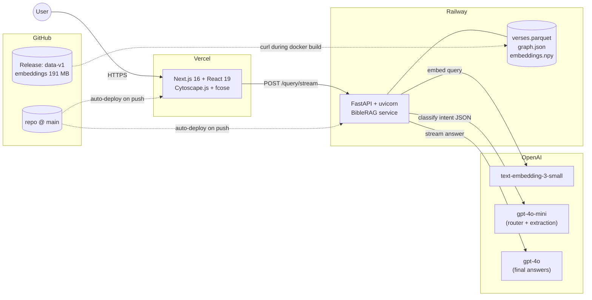
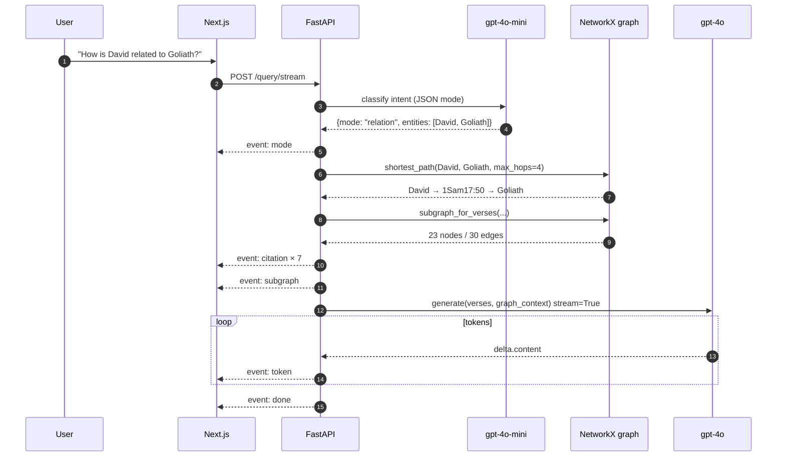
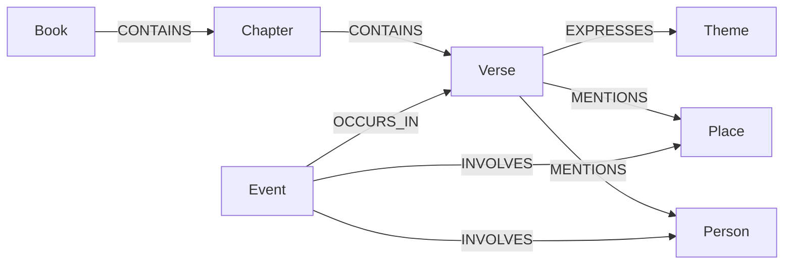

# BibleGraphRAG

A graph-augmented retrieval system over the King James Bible. Ask any
question — a routed RAG pipeline retrieves the relevant verses *and*
the relevant slice of a 38,922-node knowledge graph, then streams back
a grounded answer with an interactive subgraph rendered in the browser.

**Live demo →** [kjv-graphrag-chat.vercel.app](https://kjv-graphrag-chat.vercel.app)

## What makes it interesting

- **Knowledge graph over scripture, not just a vector index.** A
  per-chapter LLM extraction pass (1,189 chapters × `gpt-4o-mini` in
  JSON mode) materializes 1,855 Persons, 1,108 Places, 2,496 Events,
  and 1,106 Themes wired into the verse graph with typed edges.
  Relation queries like *"How is David related to Goliath?"* resolve
  via a graph shortest-path, not by cosine similarity over prose.
- **Multi-model orchestration with cost in mind.** `gpt-4o-mini`
  classifies intent and runs ingestion extraction, `text-embedding-3-small`
  handles semantic search, `gpt-4o` only writes the final grounded
  answer. Different jobs, different models, deliberate spend.
- **Streaming-first UX.** `POST /query/stream` returns a typed SSE
  stream (`mode → citation* → graph_context* → subgraph → token* → done`).
  The Next.js client patches the assistant bubble, sources panel, and
  Cytoscape subgraph as events arrive — no library, just `fetch` +
  `getReader`.
- **End-to-end ownership.** Ingestion pipeline, routed retrieval,
  FastAPI service, Next.js 16 / React 19 UI with a Cytoscape.js +
  fcose force-directed graph panel, and a Railway + Vercel production
  deployment that redeploys on `git push`.

## Architecture



## How a query is answered



## Graph schema



Backed by a NetworkX `MultiDiGraph`: **66 Books · 1,189 Chapters ·
31,102 Verses · 1,855 Persons · 1,108 Places · 2,496 Events · 1,106
Themes → 38,922 nodes / 76,404 edges.**

## Routed retrieval modes

| Mode | Triggered by | Retrieval |
|---|---|---|
| `lookup` | explicit reference (`Genesis 1:1`, `John 3:16-17`) | `verses_by_ref` |
| `entity` | one person or place (*"Who was Moses?"*) | `verses_mentioning` + events |
| `theme` | abstract topic (*"verses about forgiveness"*) | `verses_by_theme` + semantic fallback |
| `relation` | two entities (*"David and Goliath?"*) | graph shortest-path + semantic blend |
| `semantic` | free-form question | cosine top-k over embeddings |
| `hybrid` | mixed entity + theme (default fallback) | union of entity, theme, semantic |

Routing itself uses a fast-path regex for explicit refs; everything
else goes through `gpt-4o-mini` with `response_format={"type": "json_object"}`.

## Tech stack

| Layer | Stack |
|---|---|
| Frontend | Next.js 16 · React 19 · Tailwind 4 · cytoscape · cytoscape-fcose |
| Backend | FastAPI · uvicorn · pydantic · python-dotenv |
| Retrieval | NumPy (cosine over 31,102 × 1,536-d embeddings) · NetworkX |
| Models | OpenAI `text-embedding-3-small` · `gpt-4o-mini` · `gpt-4o` |
| Streaming | Server-Sent Events (native `fetch` + `getReader` on the client) |
| Data | pandas · pyarrow (parquet) |
| Deploy | Docker on Railway · Vercel · GitHub Releases for large artifacts |

## Run locally

```bash
# Backend (Python 3.13)
pip install -r requirements.txt
echo "OPENAI_API_KEY=sk-..." > .env
python bible_ingest.py            # parse KJV, embed, extract, build graph (~15 min)
uvicorn api:app --port 8000

# Frontend (Node 22+)
cd frontend
npm install
echo "NEXT_PUBLIC_API_URL=http://localhost:8000" > .env.local
npm run dev
```

Open [http://localhost:3000](http://localhost:3000).

`bible_ingest.py` is fully resumable — each chapter's LLM extraction is
cached as a JSON file, and the embedding step is gated by file shape.
Killing the script mid-run and restarting picks up where it left off.

## Deploy

### Backend → Railway

1. Upload `data/verse_embeddings.npy` to a GitHub Release tagged `data-v1`
   (the Dockerfile `curl`s it during build to keep the snapshot small).
2. Create a Railway service, connect the GitHub repo, branch `main`.
3. Set `OPENAI_API_KEY` and `ALLOWED_ORIGINS` in service Variables.
4. Generate a public domain.

### Frontend → Vercel

1. Import the repo, set Root Directory to `frontend`, Framework Preset
   to Next.js.
2. Add `NEXT_PUBLIC_API_URL` = your Railway URL.
3. Deploy.

Both sides redeploy automatically on `git push`.

## Project layout

```
.
├── api.py                  FastAPI: /health, /query, /query/stream (SSE)
├── app.py                  Streamlit prototype (kept for reference)
├── bible_graph.py          graph schema, build, query, pyvis viz
├── bible_ingest.py         parse KJV → embed → LLM-extract → build graph
├── bible_rag.py            routed retrieval + streaming answer generator
├── data/
│   ├── verses.parquet      31,102 verses
│   └── graph.json          38,922-node graph (node-link JSON)
├── Dockerfile              python:3.13-slim, curl-fetches embeddings
├── frontend/
│   ├── app/page.tsx        chat UI, SSE consumer, tabbed Graph/Sources
│   └── app/components/
│       └── GraphPanel.tsx  Cytoscape.js + fcose force-directed layout
└── kjv.txt                 source corpus
```

## Design notes

- **JSON mode everywhere structured.** Every router and ingestion call
  uses `response_format={"type": "json_object"}`. Hallucination fails at
  the parser instead of leaking downstream.
- **Lazy OpenAI client.** `BibleRAG` boots without `OPENAI_API_KEY`, so
  `/health` works in cold-start probes; only `/query` actually needs the
  key.
- **Streaming events are transport-agnostic.** `answer_stream` yields
  plain `(event_name, payload)` tuples; the SSE adapter in `api.py` is
  about ten lines. A future WebSocket or React Server Components route
  reuses the same generator unchanged.
- **Object storage for the large artifact.** The 191 MB embeddings file
  exceeds GitHub's 100 MB per-file hard limit. Hosting it as a GitHub
  Release asset and fetching with `curl` in the Dockerfile is simpler
  than Git LFS and stays inside the free tier.
- **CORS fails closed.** `ALLOWED_ORIGINS` defaults to
  `http://localhost:3000` (not `*`), comma-separated for prod. A
  deployment that forgets to set it blocks browsers instead of opening
  the API to every origin.
- **Per-IP rate limiting.** `/query` and `/query/stream` are capped at
  `QUERY_RATE_LIMIT` (default `10/minute`) via `slowapi`, since both hit
  paid OpenAI calls and the API has no auth. Exception details are
  logged server-side only — clients get a generic 500, not a stack
  trace.

## Roadmap

- **WebSocket transport** for multi-turn conversations with retrieval memory.
- **pgvector** instead of in-memory NumPy, so the backend can run on
  Vercel Functions and drop the persistent Railway service.
- **Click-through graph navigation**: clicking a node in the Cytoscape
  panel pivots the next chat turn to that entity.
- **Eval harness**: golden Q/A pairs tracking retrieval recall and
  citation precision across model swaps.

## License

MIT.
